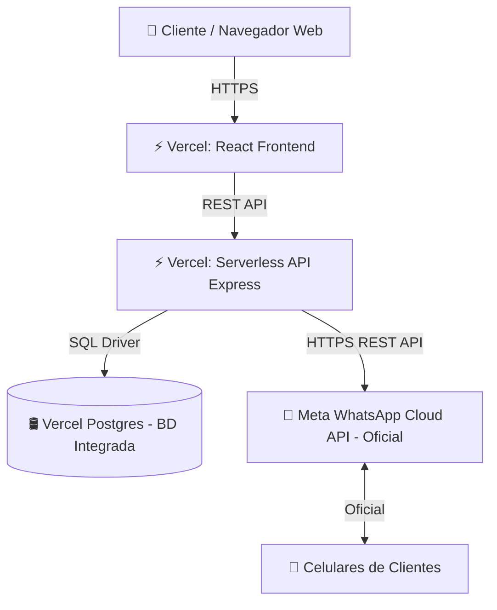

# 🚀 Guía Completa de Evaluación y Migración a Vercel - Tiendita

Este documento contiene la **evaluación técnica completa** del sistema **Tiendita** y las opciones para migrar la aplicación a **Vercel**, evaluando tanto la opción híbrida como la **Opción 100% Servidores/Servicios en Vercel (Sin VPS ni contenedores externos)**.

---

## 1. 📊 Evaluación de Alternativas de Migración

| Componente | Opción A: Híbrida (Con Servidor Externo) | Opción B: 100% Vercel Native (Sin Servidores Ni Volúmenes Externos) |
| :--- | :--- | :--- |
| **Frontend** | Vercel (React + Vite) | Vercel (React + Vite) |
| **Backend** | Vercel Serverless Functions | Vercel Serverless Functions |
| **Base de Datos** | Azure SQL / MSSQL Cloud externo | **Vercel Postgres** (Servicio Nativo de Vercel) |
| **WhatsApp** | OpenWA en Render/Railway con volumen | **Meta WhatsApp Cloud API Oficial** (Directo desde Vercel sin servidor) |

---

## 2. 🟢 Opción B: Migración 100% Nativa en Vercel (Recomendada)

Si **no quieres mantener volúmenes ni contenedores en servicios externos (como Render o Railway)**, puedes lograr una arquitectura 100% Serverless utilizando las herramientas de Vercel y Meta:



### ¿Por qué esta opción es ideal?
1. **0 Servidores que administrar**: Todo se ejecuta dentro del ecosistema Vercel + Meta.
2. **0 Volúmenes o discos**: No hay riesgo de perder archivos de sesión de WhatsApp.
3. **Costo $0 USD para empezar**: Vercel Postgres tiene Tier Gratuito y Meta da **1,000 conversaciones gratis al mes**.

---

### Paso 1: Cambio de Base de Datos a Vercel Postgres

Vercel ofrece **Vercel Postgres** (basado en Neon PostgreSQL). Es ultrarrápido y serverless.

#### 1. Crear la Base de Datos en Vercel
1. Ve a tu proyecto en Vercel -> pestaña **Storage** -> Haz clic en **Create Database** -> Selecciona **Postgres**.
2. Vercel creará la BD y vinculará automáticamente las variables de entorno (`POSTGRES_URL`, `POSTGRES_USER`, `POSTGRES_PASSWORD`, `POSTGRES_HOST`, etc.).

#### 2. Cambios requeridos en el código Backend (`backend/server.js`)
- Reemplazar el paquete `mssql` por `pg` (o `@vercel/postgres`).
- Adaptar las consultas SQL de sintaxis SQL Server a PostgreSQL:

| Concepto | SQL Server (Actual) | PostgreSQL (Vercel) |
| :--- | :--- | :--- |
| Auto-incremental | `INT IDENTITY(1,1)` | `SERIAL` o `BIGSERIAL` |
| Cadenas | `NVARCHAR(120)` | `VARCHAR(120)` o `TEXT` |
| Fechas | `DATETIME2 DEFAULT GETDATE()` | `TIMESTAMP DEFAULT CURRENT_TIMESTAMP` |
| Parámetros | `@clientId` | `$1`, `$2`, etc. |
| Límites | `SELECT TOP 1 ...` | `SELECT ... LIMIT 1` |
| Creación de Tablas | `IF OBJECT_ID('...') IS NULL` | `CREATE TABLE IF NOT EXISTS ...` |

#### 3. Migrar los Datos de `tiendita_backup.bak` a Vercel Postgres
- Convertir las tablas e información de tu respaldo SQL Server a un archivo script `.sql` compatible con PostgreSQL.
- Ejecutar el script desde el explorador de consultas de **Vercel Storage Query Editor** o conectándote con **DBeaver** / **pgAdmin** usando los datos de conexión de Vercel.

---

### Paso 2: Cambiar WhatsApp a Meta WhatsApp Cloud API (Sin Volúmenes ni Contenedores)

Para enviar mensajes de WhatsApp directamente desde Vercel sin tener un contenedor de OpenWA con volumen:

#### 1. Configurar la API Oficial de Meta (WhatsApp Business Cloud API)
1. Entra a [developers.facebook.com](https://developers.facebook.com) y crea una aplicación tipo **Business**.
2. Agrega el producto **WhatsApp**.
3. Obteń tu **System User Access Token** y el **Phone Number ID**.
4. Meta te otorga un número de prueba gratuito y **1,000 conversaciones gratis cada mes**.

#### 2. Código de Envío Serverless desde Vercel (`backend/server.js`)
Reemplazar la llamada HTTP a `callOpenWA` por una llamada REST directa a Meta:

```javascript
async function sendWhatsAppTicketViaMeta(phone, message) {
  const token = process.env.META_WHATSAPP_TOKEN;
  const phoneNumberId = process.env.META_PHONE_NUMBER_ID;

  const url = `https://graph.facebook.com/v18.0/${phoneNumberId}/messages`;

  const response = await fetch(url, {
    method: "POST",
    headers: {
      "Authorization": `Bearer ${token}`,
      "Content-Type": "application/json",
    },
    body: JSON.stringify({
      messaging_product: "whatsapp",
      to: phone, // Ejemplo: "5215512345678"
      type: "text",
      text: { body: message }
    })
  });

  return await response.json();
}
```

---

## 3. 🔵 Opción A: Arquitectura Híbrida (SQL Server Externa + OpenWA en VPS)

Si prefieres **no modificar el código SQL ni cambiar la librería de WhatsApp**, la arquitectura requiere:
1. **Base de Datos**: Hospedar SQL Server en **Azure SQL Database** o **Railway MSSQL**.
2. **WhatsApp**: Hospedar la imagen `ghcr.io/rmyndharis/openwa` en **Render** / **Railway** o un **VPS (Hetzner / DigitalOcean)** adjuntando un volumen en `/app/data` para que no se pierda la vinculación del código QR.

*(Ver secciones anteriores del documento para la guía paso a paso de la Opción A)*.

---

## 4. 🚀 Pasos para Desplegar la Opción 100% Vercel

1. **Vincular Repositorio**: Conecta tu repositorio de GitHub a Vercel.
2. **Crear Vercel Postgres**: Crea la base de datos en la pestaña *Storage* de Vercel.
3. **Variables de Entorno**: Agrega `JWT_SECRET`, `ADMIN_USER`, `ADMIN_PASS`, `META_WHATSAPP_TOKEN` y `META_PHONE_NUMBER_ID` en Vercel.
4. **Deploy**: Vercel compilará el Frontend React e instalará las Serverless Functions.

---
*Documento actualizado con la arquitectura 100% Servidores/Servicios en Vercel (Postgres + Meta API).*
